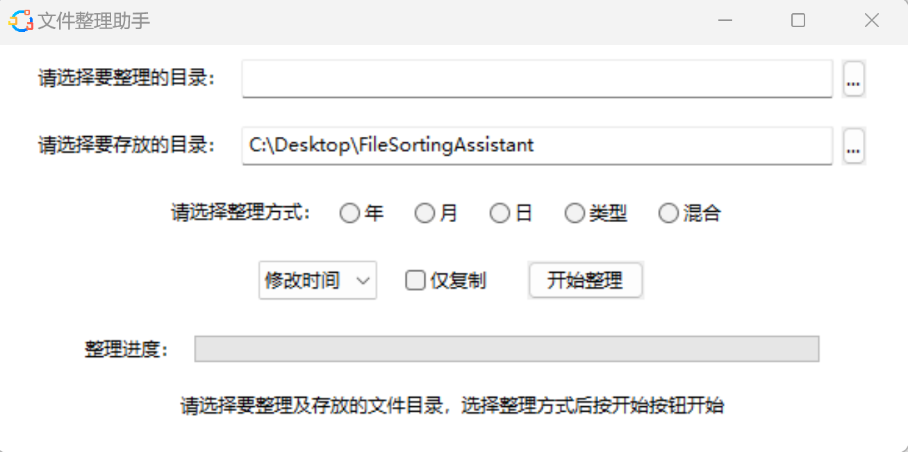

# Filesortingassistant 文件整理助手

Filesortingassistant文件整理助手 是一个基于Python开发的文件整理软件，可按照时间、类型对批量整理文件，可去除重复文件，采用界面开发，方便快捷，省去繁琐的命令输入。

双击打包好的exe文件即可运行，无需安装依赖环境。
 [`Release`](https:////github.com/dpufor/Filesortingassistant/releases) 
整理方式有：按年、月、日、类型、日+类型。

可选择文件创建、修改、访问时间作为整理依据，可对源文件进行拷贝整理，整理过程中进度时时显示。

（本项目仅作为练手项目，代码可任意修改）
